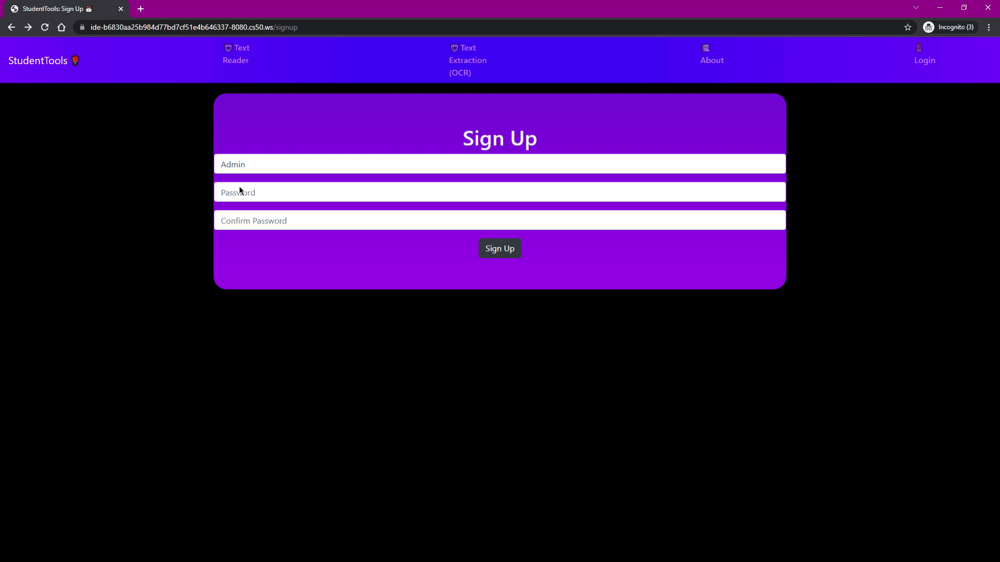
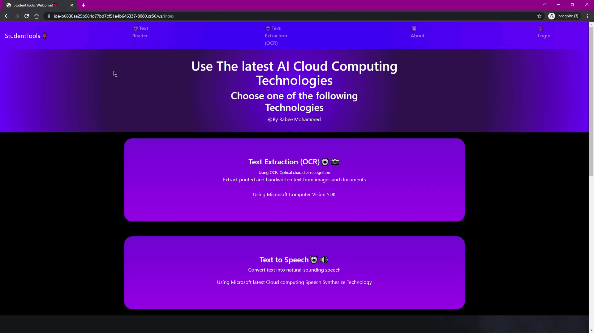
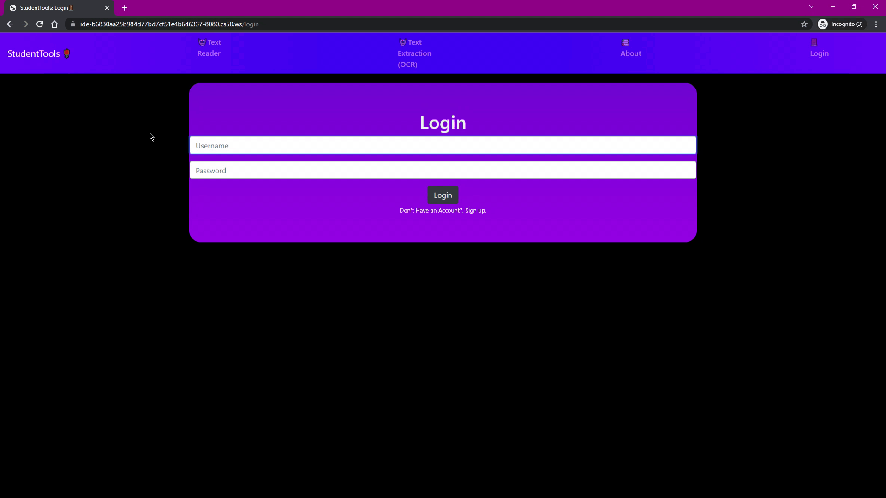

# CS50 Final Project - StudentTools 👨‍🎓📚
*StudentTools* is a web app using Flask and Bootstrap where students can find all of the tools they need to succeed.

# Features
- [Microsoft Cognitive Services Speech SDK](https://github.com/microsoft/cognitive-services-speech-sdk-js)
- [Microsoft Cognitive Services Computer Vision SDK](https://github.com/Azure/azure-sdk-for-python/tree/main/sdk/cognitiveservices/azure-cognitiveservices-vision-computervision)
- [Azure Blob storage](https://docs.microsoft.com/en-us/azure/storage/blobs/storage-blobs-introduction)
- [Flask](https://flask.palletsprojects.com/en/2.0.x/)
- [Bootstrap](https://getbootstrap.com/)
- [SQlite3](https://www.sqlite.org/index.html)
- [PostgreSQL](https://www.postgresql.org/)

# Prerequsites 📃

## Dependancies
The following are the core dependancies required
- flask 
- flask_session
- azure.cognitiveservices.vision.computervision
- azure.cognitiveservices.vision.computervision.models
- azure.storage.blob
- For All dependancies check here [Requiremenets](https://github.com/Dev-R/student-tools/blob/main/requirements.txt)
## Set up

## Set to the full path of the upload file in static
- UPLOAD_FOLDER = ''
##  Set to the full path of the current Project Directory 
- CURRENT_PROJECT_DIR = ''

## Add Azure Computer Vision Token and Endpoint in helpers.py
- subscription_key = "ENTER YOUR MICROSOFT COMPUTER VISION KEY"
- endpoint = "ENTER YOUR MICROSOFT COMPUTER VISION ENDPOINT"

## Add Azure Text To Speech Token in SpeechSDK.js 
- subscriptionKey = 'ENTER YOUR MICROSOFT TTS subscriptionKey';
- serviceRegion = 'ENTER YOUR MICROSOFT TTS REGION';

### Export Azure Connection String 

export AZURE_STORAGE_CONNECTION_STRING = "YOUR CONNECTIONS STRING"

### Set up Azure Storage Account name 

AZURE_STORGE_ACCOUNT = "Azure Storage Account Name "

### Set up  Azure BLOB Container name

CONTAINER_NAME = "BLOB CONTAINER NAME"

### The AZURE_STORGE_ACCOUNT, CONTAINER_NAME are concatinated it together to produce the following link
"https://" + AZURE_STORGE_ACCOUNT + ".blob.core.windows.net" + '/' + CONTAINER_NAME + '/' + filename"
# Project Explaination
## Project Background
The project main idea is to provide a site where students can find all of the tools they need, in such a way
they don't need to visit more than one site for different tools. 
- The students(users) can use *OCR(Optical character recognition)*
to extract text from *images or there hand written notes* 
- The students(users) can *converts text to lifelike speech* using Microsoft Azure TTS SDK
- The students(users) can login and *save and check their upload history*.

# Demonstration
## Main Page
- 

## Responsivity
- 

## History and Signup

| History | Signup |
| :---: | :---: | 
|  | 

## Login and Validation

| Login | Validation |
| :---: | :---: | 
|  | 

## Live Demonstration

## Anatomy

### Backend
- Used Flask Framework to run the back end
- Used Azure Microsoft Cognitive Services Computer Vision SDK to process images
- Used Azure BLOB to store media object
### Security
- Use POST request to send data to the server as it is more secure then GET
- Encrypt user password using SHA256 hash function 
- Use UUID to change image name to new secure name
### Database
- The Database use PostgreSQL for quries and Azurre BLOB for media. It is used to stores user credentials and students OCR upload History.
  there are mainly two tables, Users and OCR
## Users Table
 - 
 - 
Stores user information such as username, hashed password, membership and their registration date
## OCR Table
 - 
 - 
Stores  BLOB container link, text extracted from images, and the execution time
### Sessions
The Webapp use sessions to confirm user identity. Furthemore, it use filesystem sessions and it creates a unique sessions id for each user and store it in the system uniquely using  mkdtemp().
python
# The directory where session files are stored.
app.config["SESSION_FILE_DIR"] = mkdtemp()
# Whether use permanent session or not, default to be True
app.config["SESSION_PERMANENT"] = False
# Specifies which type of session interface to use.
app.config["SESSION_TYPE"] = "filesystem"

## Possible improvements 📃
*Ability to*:
- Change account details
- Delete uploaded files
- Email verification
- Store server errors in a DB
- User profile
- Further tools such as file converters etc.
